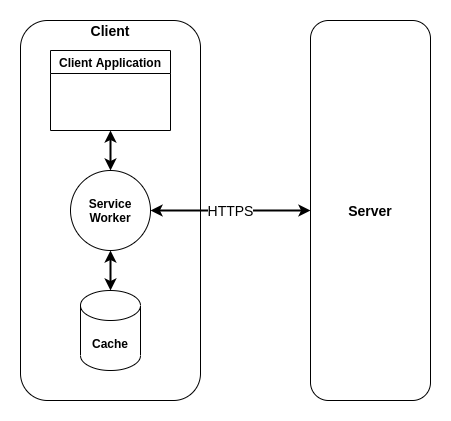
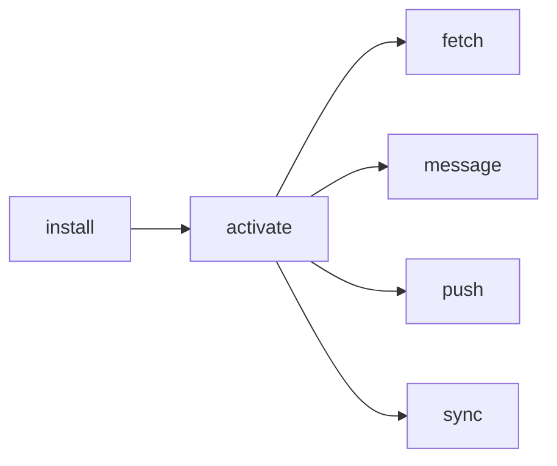

# **Service Worker API**
 

## **Table Of Contents**
 

- [**Service Worker API**](#service-worker-api)
  - [**Table Of Contents**](#table-of-contents)
  - [**General**](#general)
  - [**Events**](#events)
    - [**Install**](#install)
    - [**Activate**](#activate)
    - [**Fetch**](#fetch)
    - [**Message**](#message)
    - [**Push**](#push)
    - [**Sync**](#sync)

 
 
 
 

## **General**
 

 

 
 
 

## **Events**
 

 
 

### **Install**
 

 
 

### **Activate**
 

 
 

### **Fetch**
 

 
 

### **Message**
 

 
 

### **Push**
 

 
 

### **Sync**
 

<!--

- javascript file that
  - runs in your browser in a different thread than the main code of your app
  - runs over HTTPs
  - runs in a worker context for a specific website
  - acts as proxy server between web application, browser and network
    - intercept and modify network request
    - cache resources
    - allow access to push notifications
    - allow background sync APIs 

What a Service Worker can NOT do?
- access DOM
- use synchronous APIs
- dynamically import JavaScript modules

Initialization
- registered via method
- Events:
  - Download (starts when webpage is first accessed)
  - Install (downloaded worker is new or different to current service worker)
  - Activate (after installation; if older service worker is still active, the updated worker is activated when all pages are closed)

Update
- navigate to in-scope page
- event fired on service worker that was not downloaded in last 24 hours

Fetch Event

-->
