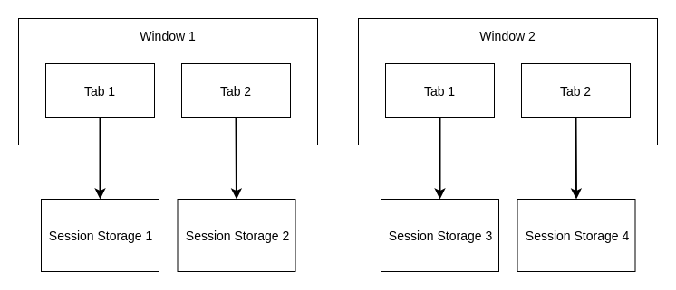
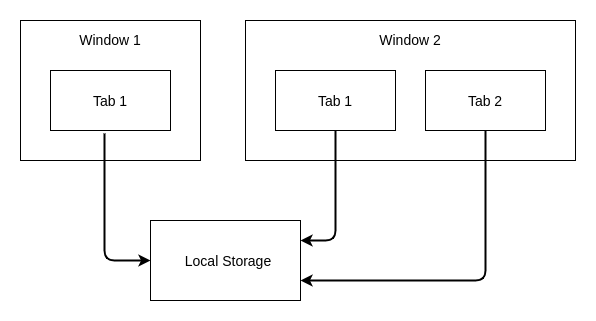

# **Web Storage API**

<br>

## **Table Of Contents**
<br>

- [**Web Storage API**](#web-storage-api)
  - [**Table Of Contents**](#table-of-contents)
  - [**General**](#general)
    - [**sessionStorage**](#sessionstorage)
    - [**localStorage**](#localstorage)
  - [**Storage**](#storage)
    - [**Properties**](#properties)
      - [**length**](#length)
    - [**Methods**](#methods)
      - [**setItem(key, value)**](#setitemkey-value)
      - [**key(index)**](#keyindex)
      - [**getItem(key)**](#getitemkey)
      - [**removeItem(key)**](#removeitemkey)
      - [**clear()**](#clear)
  - [**StorageEvent**](#storageevent)
    - [**Properties**](#properties-1)
      - [**key**](#key)
      - [**newValue**](#newvalue)
      - [**oldValue**](#oldvalue)
      - [**storageArea**](#storagearea)
      - [**url**](#url)
  - [**Example**](#example)

<br>
<br>
<br>
<br>

## **General**
<br>

Browsers can store data as key-value pairs as strings with the Web Storage API. There are two storage types:

<br>

### **sessionStorage**
* each origin has a separate storage area
* data is stored for the session duration (until browser/tab is closed) 
* _window.sessionStorage_ returns _Storage_ object

<br>



<br>
<br>
<br>

### **localStorage**
* data is stored persistently for each origin with no expiration date
* _window.localStorage_ returns _Storage_ object

<br>



<br>
<br>
<br>
<br>

## **Storage**
<br>

* acess object returned by window.sessionStorage and window.localStorage

<br>
<br>

### **Properties**
<br>
<br>

#### **length**
* returns number of stored key-value pairs

<br>
<br>
<br>

### **Methods**
<br>
<br>

#### **setItem(key, value)**
* add new key-value pair 
* update value for existing key

<br>
<br>

#### **key(index)**
* returns name of key at index

<br>
<br>

#### **getItem(key)**
* return value of specified key
* return _null_ if key does not exist

<br>
<br>

#### **removeItem(key)**
* remove key-value pair for specified key

<br>
<br>

#### **clear()**
* remove all key-value pairs

<br>
<br>
<br>
<br>

## **StorageEvent**
<br>

* triggered when storage area was modified in the another document context

<br>

```javascript
addEventListener('storage', event => { /* implementation */});
```

<br>
<br>

### **Properties**
<br>
<br>

#### **key**
* returns changed key name

<br>
<br>

#### **newValue**
* returns new value

<br>
<br>

#### **oldValue**
* returns old value

<br>
<br>

#### **storageArea**
* returns affected _Storage_ object

<br>
<br>

#### **url**
* returns url string of document

<br>
<br>
<br>
<br>

## **Example**
<br>

```javascript
localStorage.setItem('key', 'value');
localStorage.setItem('key', 'newValue');
localStorage.setItem('key2', 'value');
localStorage.setItem('key3', 'value');

console.log(localStorage.getItem('key'));           // returns 'newValue'

for (let i = 0; i < localStorage.length; i++) {
    console.log(localStorage.key(i));               // returns 'key', 'key2', 'key3'
}

localStorage.removeItem('key');                     // localStorage contains 'key2', 'key3'
localStorage.clear();                               // localStorage is empty
```
