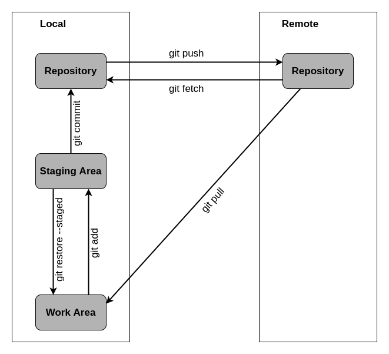

# **Git Commands**
<br>

## **Table Of Contents**
<br>

- [**Git Commands**](#git-commands)
  - [**Table Of Contents**](#table-of-contents)
  - [**Workflow For Files**](#workflow-for-files)
  - [**Initialize And Configuration**](#initialize-and-configuration)
  - [**Clone Existing Repository**](#clone-existing-repository)
  - [**Remote Repositories**](#remote-repositories)
  - [**Repository Status**](#repository-status)
  - [**Add And Commit File To Local Repository**](#add-and-commit-file-to-local-repository)
  - [**Branches**](#branches)
  - [**Stash**](#stash)

<br>
<br>
<br>
<br>

## **Workflow For Files**
1. Untracked
2. Staging Area
3. Committed

<br>
<br>



<br>
<br>
<br>
<br>

## **Initialize And Configuration**

```bash
git init                                    # initializes git version control for current working directory
git config --list                           # show configurations, including user and email
git config --global user.name 'name'        # set user name
git config --global user.email 'email'      # set user email	
```

<br>
<br>
<br>
<br>

## **Clone Existing Repository**

```bash
git clone <repository | repository_url>     # clone
```

<br>
<br>
<br>
<br>

## **Remote Repositories**

```bash
git remote -v                               # list connections to remote repositories with url
git remote add <name> <url>                 # add connection to remote repository
git remote rm <name>                        # remove connection to remote repository 
git remote rename <old_name> <new_name>     # rename connection to remote repository
git push <remote> <branch>                  # push <branch> to <remote>
git pull <remote>                           # fetch copy of current branch from <remote> to the local repository
```

<br>
<br>
<br>
<br>

## **Repository Status**

```bash
git status      # show status of the working tree
git log         # show commit history
```

<br>
<br>
<br>
<br>

## **Add And Commit File To Local Repository**

```bash
git add <file>                  # add <file> to the staging area
git add <directory>             # add all files in the directory to the staging area
git restore --staged <file>     # remove <file> from staging area
git commit -m 'message'         # add all files in the staging area to the project
```

<br>
<br>
<br>
<br>

## **Branches**

```bash
git branch                      # list all branches
git branch -d <branch_name>     # delete <branch_name>
git switch <branch_name>        # switch to branch <branch_name>
git switch -c <new_branch>      # add and switch to <new_branch>
git merge <branch_name>         # merge <branch_name> to the current branch
```

<br>
<br>
<br>
<br>

## **Stash**

```bash
git stash                       # save all uncommitted changes and clear the staging area
git stash list                  # list all stashes
git stash pop                   # move the changes in the last stash back into the staging area
git stash pop stash@{<id>}      # move the changes in the stash <id> back into the staging area
git stash drop stash@{<id>}     # delete the changes in the stash <id>
git stash clear                 # delete all stashes
```