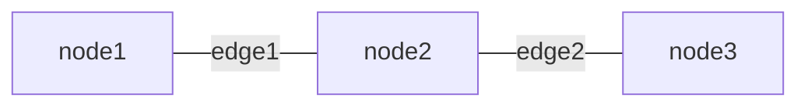

# **Mermaid**
<br>

## **Table Of Contents**
<br>

- [**Mermaid**](#mermaid)
  - [**Table Of Contents**](#table-of-contents)
  - [**General**](#general)
  - [**Links**](#links)
  - [**Deploy**](#deploy)
    - [**Add Mermaid Diagram To Markdown File In Github And GitLab**](#add-mermaid-diagram-to-markdown-file-in-github-and-gitlab)
    - [**Add Mermaid Diagram To Web Page**](#add-mermaid-diagram-to-web-page)
  - [**Syntax**](#syntax)
    - [**Comments**](#comments)
    - [**Flowchart**](#flowchart)

<br>
<br>
<br>

## **General**
<br>

* Mermaid is a tool that dynamically renders text definitions to diagrams or charts, making it easy to update
* Mermaid syntax can be embedded into html or markdown files 
* Mermaid is natively supported by github and gitlab

<br>

|Part          |Description
|:-------------|:----------
|Deploy        |Get mermaid to work
|Syntax        |Describe diagrams
|Configuration |Style diagrams

<br>
<br>
<br>

## **Links**
<br>

* [Mermaid Website](https://mermaid-js.github.io/mermaid/#/)
* [Mermaid LiveEditor](https://mermaid.live)


<br>
<br>
<br>

## **Deploy**
<br>
<br>

### **Add Mermaid Diagram To Markdown File In Github And GitLab**
<br>

```text
```mermaid
diagramType
    diagramDefinition
`` `
```

<br>
<br>

### **Add Mermaid Diagram To Web Page**
<br>

1. Link mermaid script

    ```html
    <script src="https://cdn.jsdelivr.net/npm/mermaid/dist/mermaid.min.js"></script>
    ```

<br>

2. Initialize mermaidAPI
   
    ```html
    <script>mermaid.initialize({startOnLoad: true});</script>
    ```

<br>

3. Add diagram

    ```html
    <div class="mermaid">
        <!-- diagram definition -->
    </div>
    ```

<br>
<br>
<br>

## **Syntax**
<br>
<br>
<br>

### **Comments**
<br>

```
flowchart LR
    %% This is a comment
    node1 --> node2

```

<br>
<br>

### [**Flowchart**](./mermaidDiagramSyntax/mermaidFlowchart.md)
<br>

A flowchart consists of of _nodes_ and _edges_ between the nodes.

<br>



<br>

See [Flowchart](./mermaidDiagramSyntax/mermaidFlowchart.md)