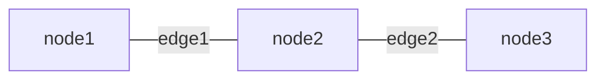
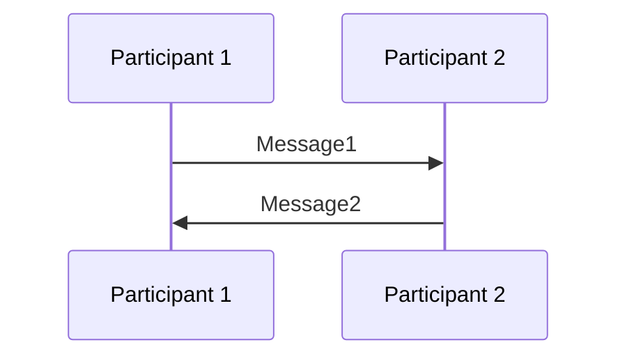
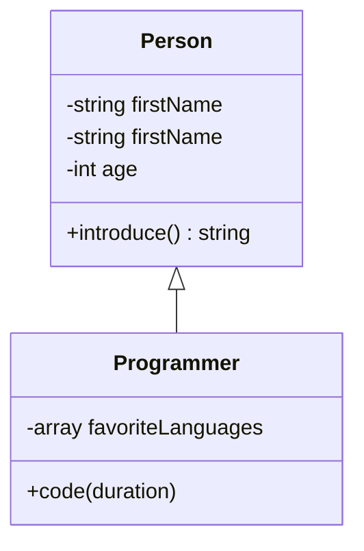
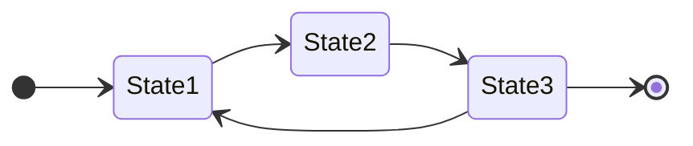
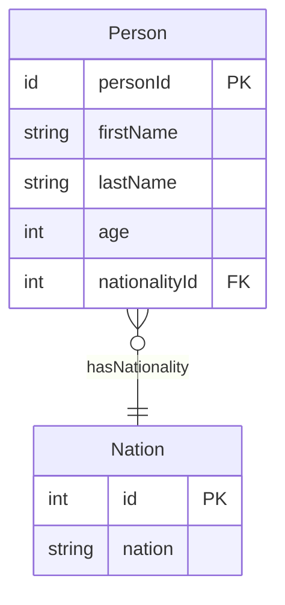
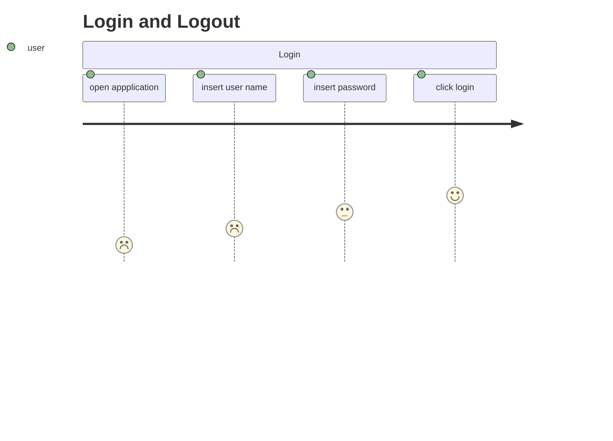
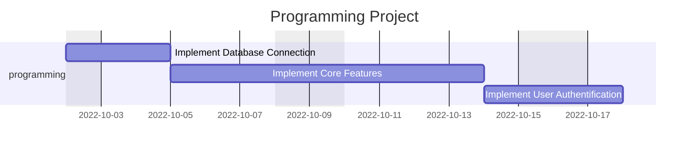
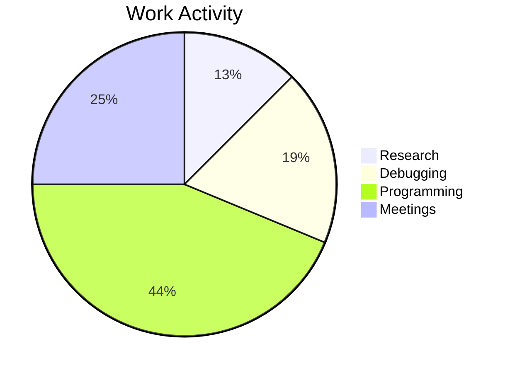

# **Mermaid**
<br>

## **Table Of Contents**
<br>

- [**Mermaid**](#mermaid)
  - [**Table Of Contents**](#table-of-contents)
  - [**General**](#general)
  - [**Links**](#links)
  - [**Deploy**](#deploy)
    - [**Add Mermaid Diagram To Markdown File In Github And GitLab**](#add-mermaid-diagram-to-markdown-file-in-github-and-gitlab)
    - [**Add Mermaid Diagram To Web Page**](#add-mermaid-diagram-to-web-page)
  - [**Syntax**](#syntax)
    - [**Comments**](#comments)
    - [**Flowchart**](#flowchart)
    - [**Sequence Diagram**](#sequence-diagram)
    - [**Class Diagram**](#class-diagram)
    - [**State Diagram**](#state-diagram)
    - [**Entity Relationship Diagram**](#entity-relationship-diagram)
    - [**User Journey Diagram**](#user-journey-diagram)
    - [**Gantt Diagram**](#gantt-diagram)
    - [**Pie Chart**](#pie-chart)

<br>
<br>
<br>

## **General**
<br>

* Mermaid is a tool that dynamically renders text definitions to diagrams or charts, making it easy to update
* Mermaid syntax can be embedded into html or markdown files 
* Mermaid is natively supported by github and gitlab

<br>

|Part          |Description
|:-------------|:----------
|Deploy        |Get mermaid to work
|Syntax        |Describe diagrams
|Configuration |Style diagrams

<br>
<br>
<br>

## **Links**
<br>

* [Mermaid Website](https://mermaid-js.github.io/mermaid/#/)
* [Mermaid LiveEditor](https://mermaid.live)


<br>
<br>
<br>

## **Deploy**
<br>
<br>

### **Add Mermaid Diagram To Markdown File In Github And GitLab**
<br>

```text
```mermaid
diagramType
    diagramDefinition
`` `
```

<br>
<br>

### **Add Mermaid Diagram To Web Page**
<br>

1. Link mermaid script

    ```html
    <script src="https://cdn.jsdelivr.net/npm/mermaid/dist/mermaid.min.js"></script>
    ```

<br>

2. Initialize mermaidAPI
   
    ```html
    <script>mermaid.initialize({startOnLoad: true});</script>
    ```

<br>

3. Add diagram

    ```html
    <div class="mermaid">
        <!-- diagram definition -->
    </div>
    ```

<br>
<br>
<br>

## **Syntax**
<br>
<br>
<br>

### **Comments**
<br>

```
flowchart LR
    %% This is a comment
    node1 --> node2

```

<br>
<br>

### [**Flowchart**](./mermaidDiagramSyntax/mermaidFlowchart.md)
<br>

A flowchart consists of of _nodes_ and _edges_ between the nodes.

<br>



<br>

See [Flowchart](./mermaidDiagramSyntax/mermaidFlowchart.md)

<br>
<br>

### [**Sequence Diagram**](./mermaidDiagramSyntax/mermaidSequenceDiagram.md)
<br>

A sequence diagram models the order of interactions between two or more participants.

<br>



<br>

See [Sequence Diagram](./mermaidDiagramSyntax/mermaidSequenceDiagram.md)

<br>
<br>

### [**Class Diagram**](./mermaidDiagramSyntax/mermaidClassDiagram.md)
<br>

A class diagram describes the structure of classes and their relationships to other classes.

<br>



<br>

See [Class Diagram](./mermaidDiagramSyntax/mermaidClassDiagram.md)

<br>
<br>

### [**State Diagram**](./mermaidDiagramSyntax/mermaidStateDiagram.md)
<br>

A state diagram describes the finite states of a system.

<br>



<br>

See [State Diagram](./mermaidDiagramSyntax/mermaidStateDiagram.md)

<br>
<br>

### [**Entity Relationship Diagram**](./mermaidDiagramSyntax/mermaidEntityRelationshipDiagram.md)
<br>

An Entity Relationship Diagram models entity types and their relationship towards each other.

<br>



<br>

See [Entity Relationship Diagram](./mermaidDiagramSyntax/mermaidEntityRelationshipDiagram.md)

<br>
<br>

### [**User Journey Diagram**](./mermaidDiagramSyntax/mermaidUserJourneyDiagram.md)
<br>

A user journey diagram descripes and rates the steps a user takes to complete a task within an application.

<br>



<br>

See [User Journey Diagram](./mermaidDiagramSyntax/mermaidUserJourneyDiagram.md)

<br>
<br>

### [**Gantt Diagram**](./mermaidDiagramSyntax/mermaidGanttDiagram.md)
<br>

A Gantt diagram describes a project schedule including order and duration of tasks.

<br>



<br>

See [Gantt Diagram](./mermaidDiagramSyntax/mermaidGanttDiagram.md)

<br>
<br>

### [**Pie Chart**](./mermaidDiagramSyntax/mermaidPieChart.md)
<br>

A pie chart describes how a total is divided between different areas.

<br>



<br>

See [Pie Chart](./mermaidDiagramSyntax/mermaidPieChart.md)