# **Mermaid Class Diagram**
<br>

## **Table Of Contents**
<br>

- [**Mermaid Class Diagram**](#mermaid-class-diagram)
  - [**Table Of Contents**](#table-of-contents)
  - [**General**](#general)
  - [**Class**](#class)
    - [**General Syntax**](#general-syntax)
    - [**Attributes**](#attributes)
      - [**Standard**](#standard)
      - [**Static**](#static)
    - [**Methods**](#methods)
      - [**Standard**](#standard-1)
      - [**Abstract**](#abstract)
      - [**Static**](#static-1)
    - [**Class Annotations**](#class-annotations)
    - [**Visibility Modifiers**](#visibility-modifiers)
    - [**Generic Types**](#generic-types)
  - [**Relationships**](#relationships)
    - [**Inheritance**](#inheritance)
    - [**Association**](#association)
    - [**Aggregation**](#aggregation)
    - [**Composition**](#composition)
    - [**Dependency**](#dependency)
    - [**Realization**](#realization)
    - [**Solid Link**](#solid-link)
    - [**Dashed Link**](#dashed-link)
    - [**Cardinality**](#cardinality)
  - [**Diagram Direction**](#diagram-direction)
  - [**Tooltips**](#tooltips)

<br>
<br>
<br>

## **General**
<br>

A class diagram describes the structure of classes and their relationships to other classes.

<br>

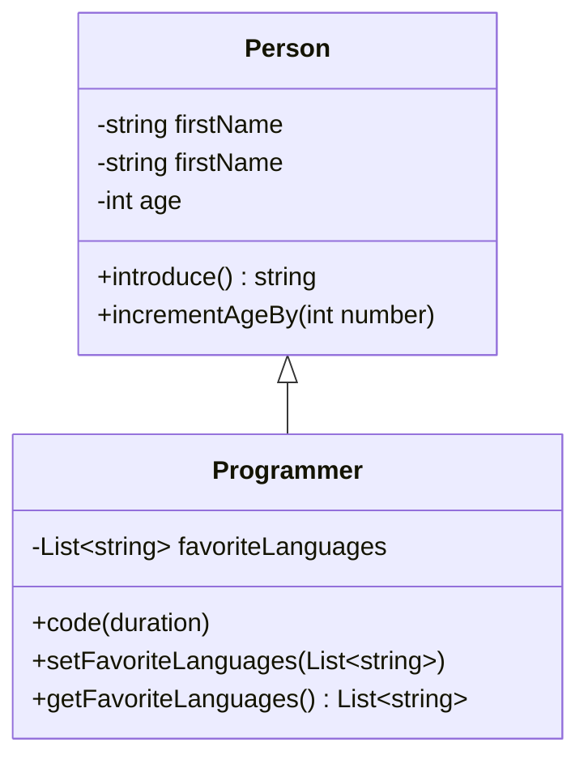

<br>
<br>
<br>

## **Class**
<br>
<br>

### **General Syntax**
<br>

Basic syntax:

```
classDiagram
    class <class name> {
        <attribute definition>
        <method definition>
    }
    <relationship definition>
```

<br>
<br>

### **Attributes**
<br>
<br>

#### **Standard**
<br>

Basic syntax:

```
<visibility modifier><type> <attribute name>
```

<br>

Example:

```
classDiagram
    class Person {
        -string firstName
        -string firstName
        -int age
    }
```

<br>

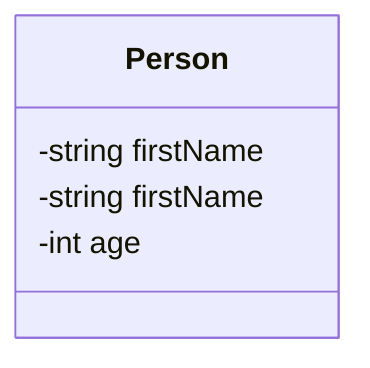
<br>
<br>

#### **Static**
<br>

Syntax:

```
<type><attribute name>$
```

<br>

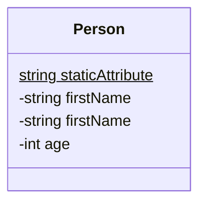

<br>
<br>

### **Methods**
<br>
<br>

#### **Standard**
<br>

Basic syntax:

```
<visibility modifier><method name>(<optional type> <parameter name>) <optional return type>
```

<br>

Example:

```
classDiagram
    class Person {
        -string firstName
        -string firstName
        -int age

        +introduce() string
        +incrementAgeBy(int number) 
    }
```

<br>

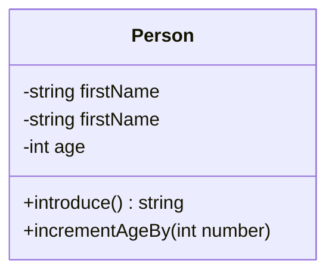

<br>
<br>

#### **Abstract**
<br>

Syntax:

```
<method name>(<optional type> <parameter name>)* <optional return type>
```

<br>

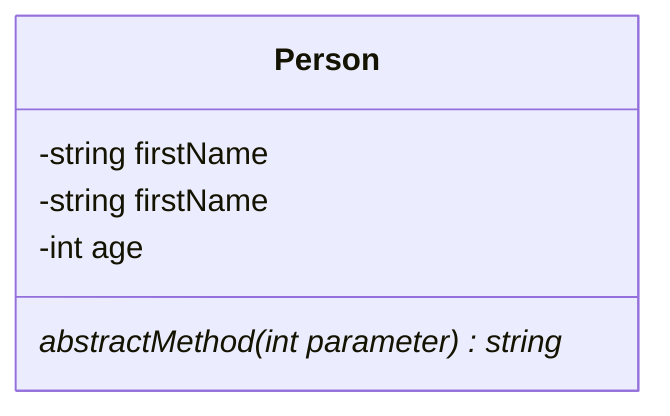

<br>
<br>

#### **Static**
<br>

Syntax:

```
<method name>(<optional type> <parameter name>)$ <optional return type>
```

<br>

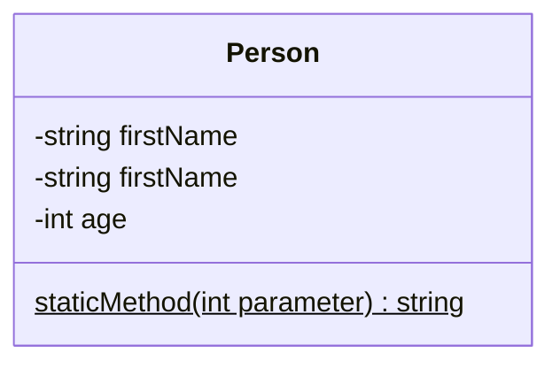

<br>
<br>

### **Class Annotations**
<br>

Syntax:

```
class className
    <<Annotation>>
```

<br>

|Available Annotation |
|:--------------------|
|\<\<Interface>>      |
|\<\<Abstract>>       |
|\<\<Service>>        |
|\<\<Enumeration>>    |

<br>

```
classDiagram
    class Person {
        <<interface>>
        firstName
        lastName
        introduce()
    }
    class ProgrammingLanguage {
        <<enumeration>>
        Python
        C
        Java
        C#
        JavaScript
    }
```

<br>

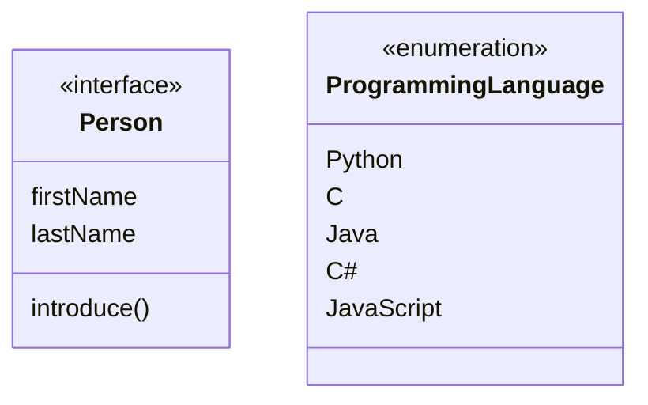

<br>
<br>

### **Visibility Modifiers**
<br>

|Modifier |Description |
|:--------|:-----------|
|+        |public      |
|-        |private     |
|#        |protected   |
|~        |package     |


<br>
<br>

### **Generic Types**
<br>

Basic syntax:

```
List~<data type>~
```

<br>

```
classDiagram
    class Programmer {
        -List~string~ favoriteLanguages
        +code(duration)
        +setFavoriteLanguages(List~string~)
        +getFavoriteLanguages() List~string~
    }
```

<br>

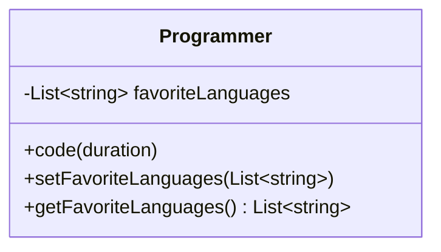

<br>
<br>

## **Relationships**
<br>
<br>

Basic Syntax:

```
<class name 1> <arrow> <class name 2> : <optional label text>
```

<br>
<br>

### **Inheritance**
<br>


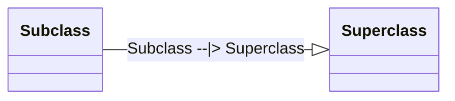

<br>
<br>

### **Association**
<br>

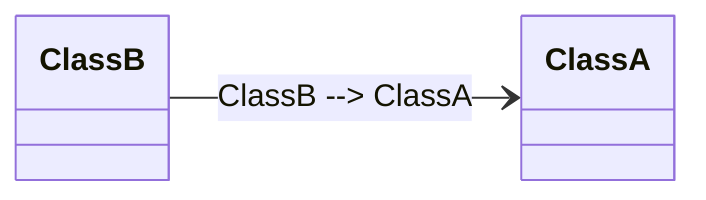

<br>
<br>

### **Aggregation**
<br>

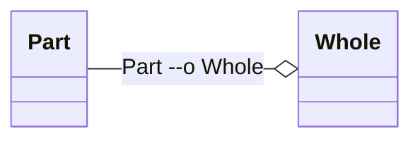

<br>
<br>

### **Composition**
<br>

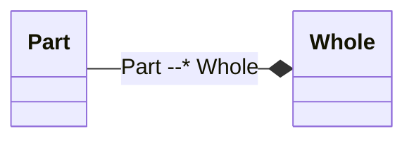

<br>
<br>

### **Dependency**
<br>

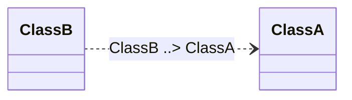

<br>
<br>

### **Realization**
<br>

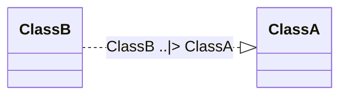

<br>
<br>

### **Solid Link**
<br>

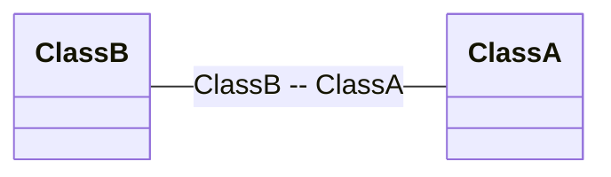

<br>
<br>

### **Dashed Link**
<br>

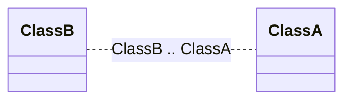

<br>
<br>

### **Cardinality**
<br>

|Cardinality |Description
|:-----------|:--------------
|1           |exactly 1
|0..1        |0 or 1
|1..*        |one or more
|*           |zero or more
|n           |exactly n
|0..n        |zero or up to n
|1..n        |one or up to n

<br>


Syntax:

```
<class name 1> "<cardinality1>" <arrow> "<cardinality>" <class name 2> : <optional label text>
```

<br>

Example: 

```
classDiagram
    Page "1..*" --> "1" Book 
```

<br>

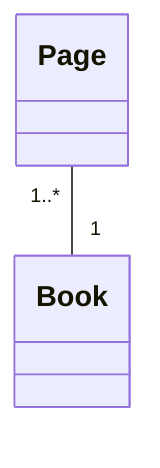

<br>
<br>
<br>

## **Diagram Direction**
<br>

Syntax:

```
classDiagram
    direction <direction>
```

<br>

LR:

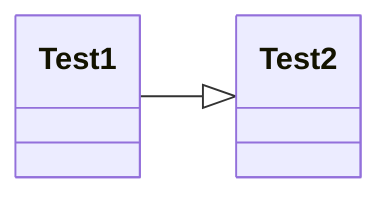

<br>

RL:

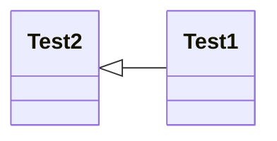

<br>

TB:

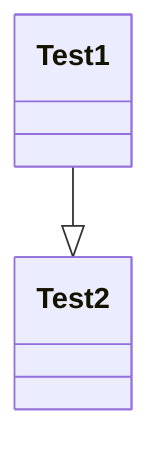

<br>

BT:

```mermaid
classDiagram
    direction BT
    Test1 --|> Test2
```

<br>
<br>
<br>

## **Tooltips**
<br>

* requires _securityLevel='loose'_

<br>

```html
<script>
    var config = {
        startOnLoad: true,
        securityLevel: 'loose'
    };
    mermaid.initialize(config);
</script>
```

<br>

```html
<script>
    var callback = function() {
        /* implementation */
    }
</script>
```

<br>

```
classDiagram
    class ClassName1
    link ClassName1 "https://github.com" "Tooltip text"
    class ClassName2
    callback className2 call callback() "Tooltip text"
```

<br>

```mermaid
classDiagram
    class ClassName1
    link ClassName1 "https://github.com" "Tooltip text"
    class ClassName2
    click ClassName2 call callback() "Tooltip text"
```