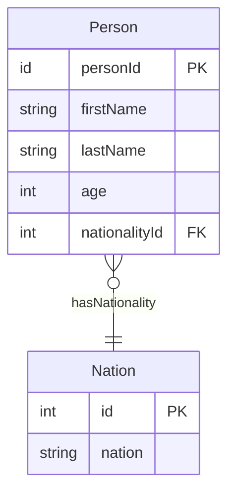
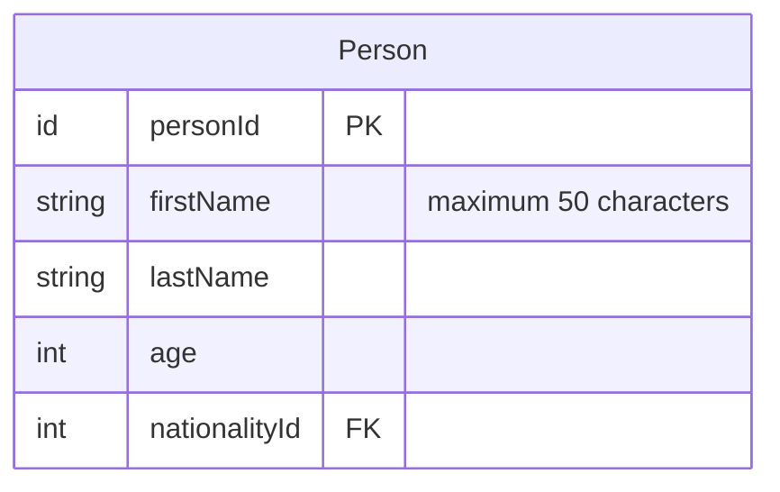
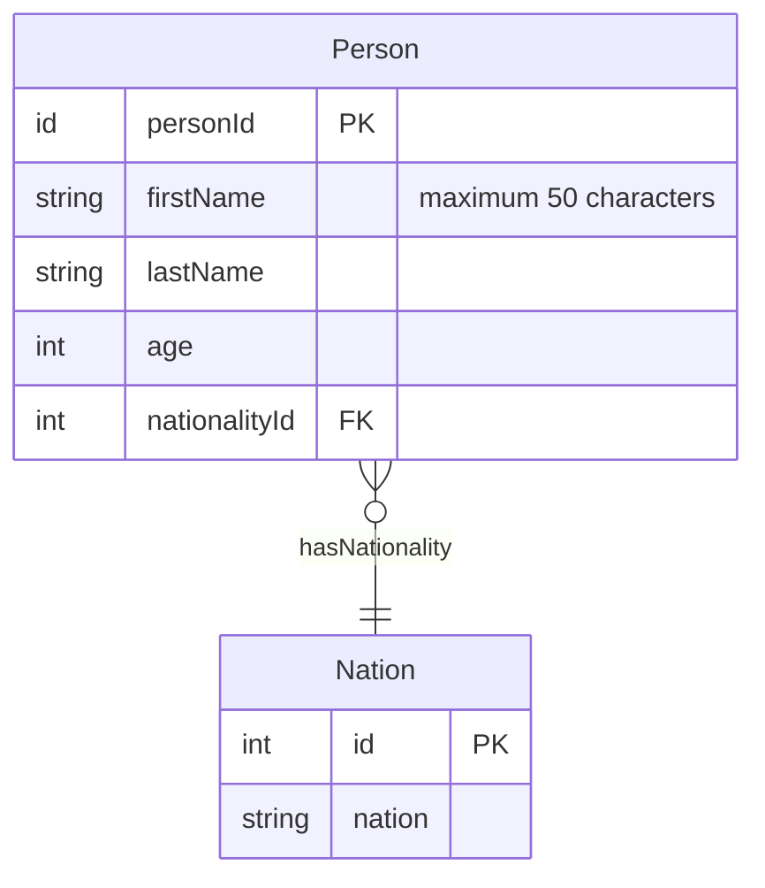

# **Mermaid Entity Relationship Diagram**
<br>

## **Table Of Contents**
<br>

- [**Mermaid Entity Relationship Diagram**](#mermaid-entity-relationship-diagram)
  - [**Table Of Contents**](#table-of-contents)
  - [**General**](#general)
  - [**Entities**](#entities)
  - [**Relationships**](#relationships)

<br>
<br>
<br>

## **General**
<br>

An Entity Relationship Diagram models entity types and their relationship towards each other.

<br>



<br>
<br>
<br>

## **Entities**
<br>

Basic syntax:

```
<entity name> {
    <type> <attribute name> [PK or FK] ["<comment text>"]
}
```

<br>

```
erDiagram
    Person {
        id personId PK
        string firstName "maximum 50 characters"
        string lastName
        int age
        int nationalityId FK
    }
```

<br>



<br>
<br>
<br>

## **Relationships**
<br>

Basic syntax:

```
<first entity> <arrow> <second entity> : [<label text>]
```

<br>

```
erDiagram
    Person {
        id personId PK
        string firstName "maximum 50 characters"
        string lastName
        int age
        int nationalityId FK
    }
    Nation {
        int id PK
        string nation
    }
    Person }o--|| Nation : hasNationality
```

<br>



<br>
<br>

|Left |Right |Description
|:----|:-----|:----------
|\|\| |\|\|  |exactly one
|\|o  |o\|   |zero or one
|}\|  |\|{   |at least one
|}o   |o{    |zero or more