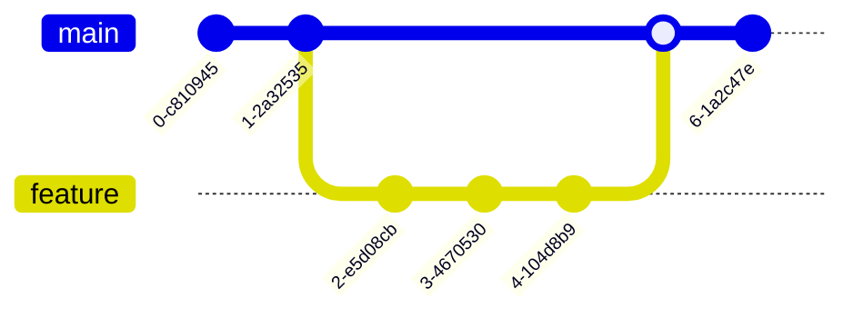
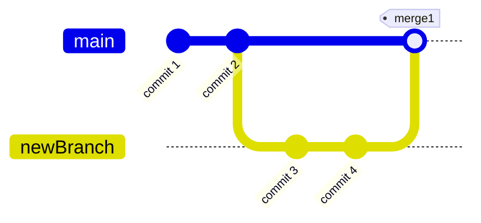
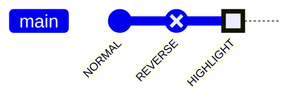

# **Gitgraph Diagram**
<br>

## **Table Of Contents**
<br>

- [**Gitgraph Diagram**](#gitgraph-diagram)
  - [**Table Of Contents**](#table-of-contents)
  - [**General**](#general)
  - [**Syntax**](#syntax)
    - [**Commit Type**](#commit-type)

<br>
<br>
<br>

## **General**
<br>

A gitgraph diagram describes the git commits on different branches.

<br>



<br>
<br>

## **Syntax**
<br>

Basic syntax:

```
gitGraph
    commit [id: "<text>"] [type: <type>] [tag: "<text">]
    branch <branch name> [order: <number>]
    checkout <branch name>
    merge <branch name> [type: <type>] [tag: "<text>"]
```

<br>

```
gitGraph
    commit id: "commit 1"
    commit id: "commit 2"
    branch newBranch
    checkout newBranch
    commit id: "commit 3"
    commit id: "commit 4"
    checkout main
    merge newBranch id: "merge1"
```

<br>



<br>
<br>

### **Commit Type**
<br>

