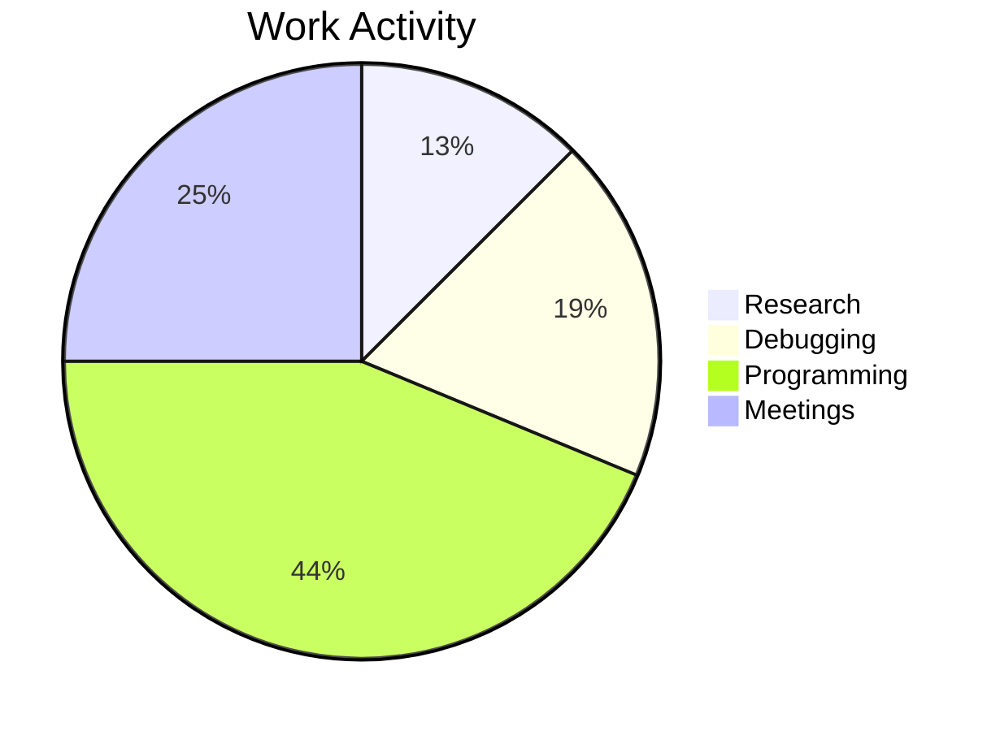
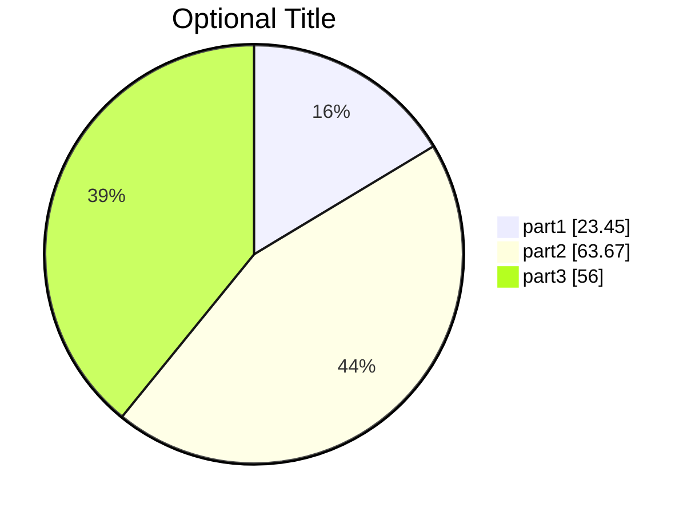

# **Mermaid Pie Chart**
<br>

## **Table Of Contents**
<br>

- [**Mermaid Pie Chart**](#mermaid-pie-chart)
  - [**Table Of Contents**](#table-of-contents)
  - [**General**](#general)
  - [**Syntax**](#syntax)

<br>
<br>
<br>

## **General**
<br>

A pie chart describes how a total is divided between different areas.

<br>



<br>
<br>
<br>

## **Syntax**
<br>

Basic syntax:

```
pie [showData]
    [title <title text>]
    
    "<label text>": <positive number>
```

<br>

```
pie showData
    title Optional Title
    
    "part1": 23.45
    "part2": 63.67
    "part3": 56
```

<br>

