# **Mermaid Sequence Diagram**
<br>

## **Table Of Contents**
<br>

- [**Mermaid Sequence Diagram**](#mermaid-sequence-diagram)
  - [**Table Of Contents**](#table-of-contents)
  - [**General**](#general)
  - [**Participants**](#participants)
    - [**Shapes**](#shapes)
    - [**Activation Period**](#activation-period)
    - [**Notes**](#notes)
    - [**Link PopUp**](#link-popup)
  - [**Messages**](#messages)
    - [**Shapes**](#shapes-1)
    - [**Loop**](#loop)
    - [**Alternative Messages**](#alternative-messages)
    - [**Optional Messages**](#optional-messages)
    - [**Parallel Messages**](#parallel-messages)
    - [**Critical Reqion**](#critical-reqion)
    - [**Break**](#break)
    - [**Activate Numbering**](#activate-numbering)
  - [**Hightlight Background**](#hightlight-background)
  - [**Style**](#style)
  - [**Configuration**](#configuration)

<br>
<br>
<br>

## **General**
<br>

A sequence diagram models the order of interactions between two or more participants.

<br>

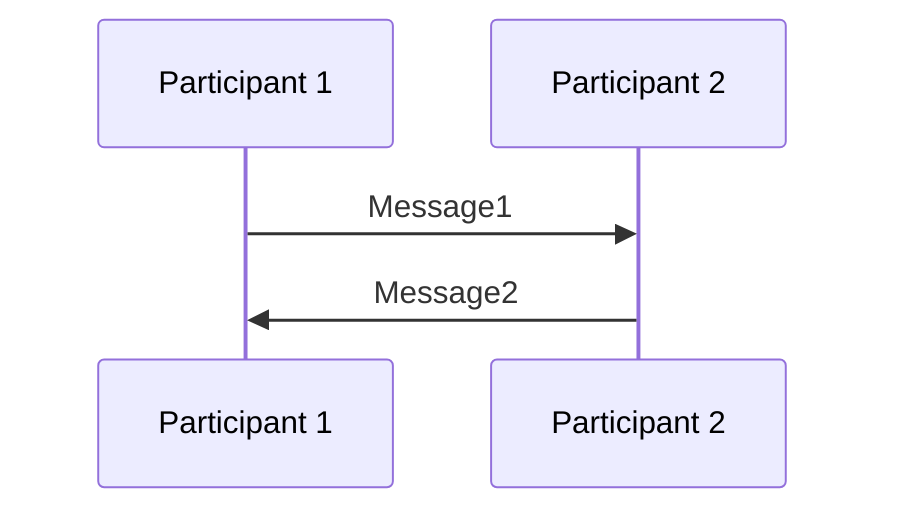

<br>
<br>
<br>

## **Participants**
<br>
<br>

### **Shapes**
<br>

```
sequenceDiagram
    participant A as Participant 1
    actor B as Participant 2 (Actor)
    A ->> B: Message
```

<br>

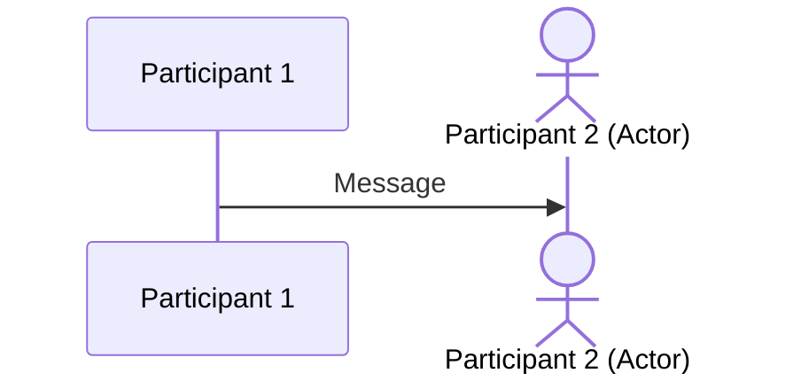

<br>
<br>

### **Activation Period**
<br>

```
sequenceDiagram
    participant A as Participant 1
    participant B as Participant 2
    A ->> B: Request
    activate B
    B ->> A: Response
    deactivate B
```

<br>

Shorthand:

```
sequenceDiagram
    participant A as Participant 1
    participant B as Participant 2
    A ->> +B: Request
    B ->> -A: Response
```


<br>

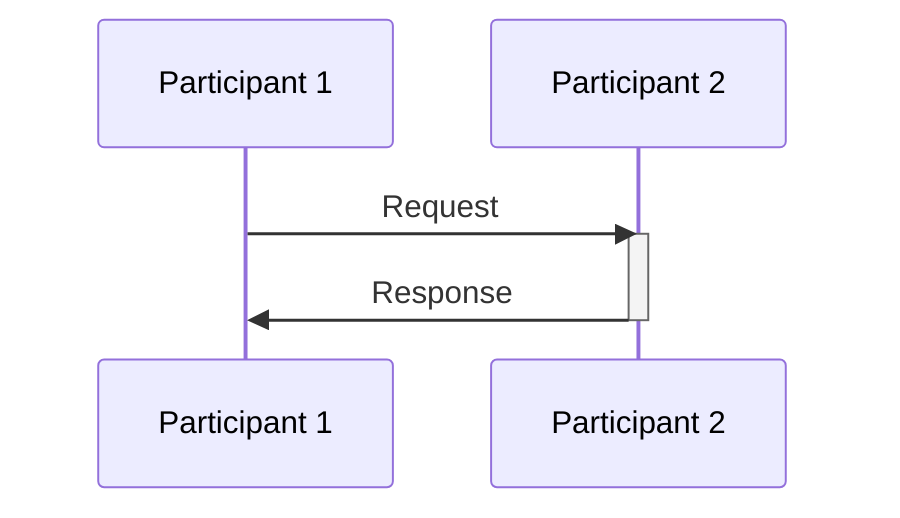

<br>
<br>

Nested Activation:

```
sequenceDiagram
    participant A as Participant 1
    participant B as Participant 2
    A ->> +B: Request 1
    A ->> +B: Request 2
    B ->> -A: Response 2
    B ->> -A: Response 1
```

<br>

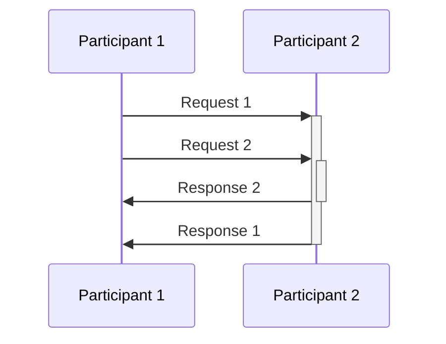

<br>
<br>

### **Notes**
<br>

Basic syntax:

```
Note <direction> <participant>: <Text>
```

<br>

```
sequenceDiagram
    participant A as Participant 1
    Note left of A: left of
    Note right of A: right of
```

<br>

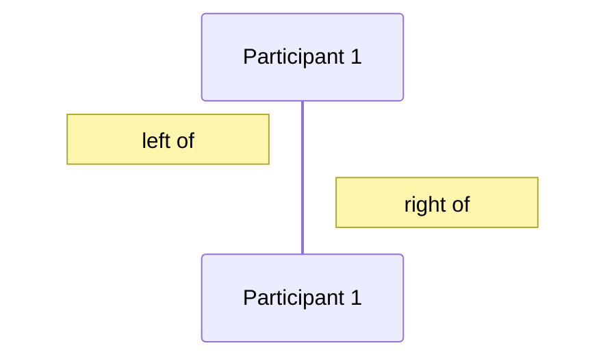

<br>
<br>

```
sequenceDiagram
    participant A as Participant 1
    participant B as Participant 2
    Note over A,B: over
```

<br>

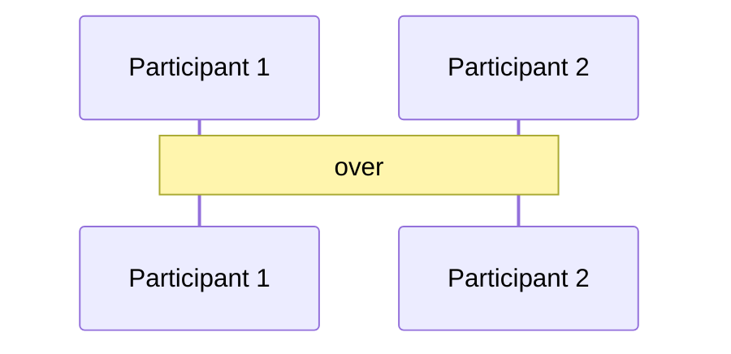

<br>
<br>

### **Link PopUp**
<br>

Basic syntax:

```
link <participant>: <labelText> @ <url>
```

<br>

Shorthand:

```
links <participant>: {"<textLabel1>": "<url1>", "<textLabel2>": "<url2>", ...}
```

<br>
<br>

```
sequenceDiagram
    participant A as Participant 1
    participant B as Participant 2
    link A: Mermaid @ https://mermaid-js.github.io/
    link A: GitHub @ https://github.com/
    A ->> B: Message
```

<br>

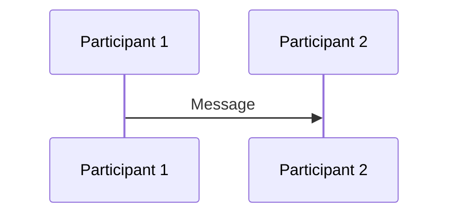

<br>
<br>
<br>

## **Messages**
<br>

Basic syntax:

```
<Participant> <Arrow> <Participant>:<message>
```

<br>
<br>

### **Shapes**
<br>

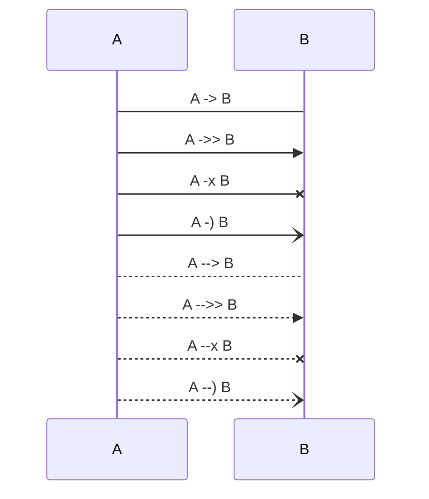

<br>
<br>

### **Loop**
<br>

Basic syntax:

```
loop <text>
    <message statements>
end
```

<br>

```
sequenceDiagram
    participant A as Client
    participant B as Server
    loop Every Minute
        A ->> B: Request
        B ->> A: Response
    end
```

<br>

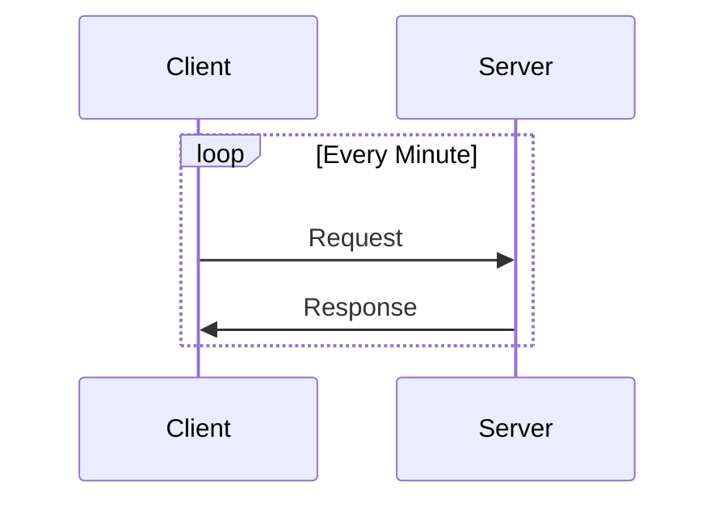

<br>
<br>

### **Alternative Messages**
<br>

Basic syntax:

```
alt <conditionText>
    <message statements>
else <conditionText>
    <message statements>
end
```

<br>

```
sequenceDiagram
    participant A as Client
    participant B as Webserver
    A ->> B: Request document
    alt document exists
        B ->>A: Response
    else document does not exist
        B ->>A: 404 Not Found
    end
```

<br>

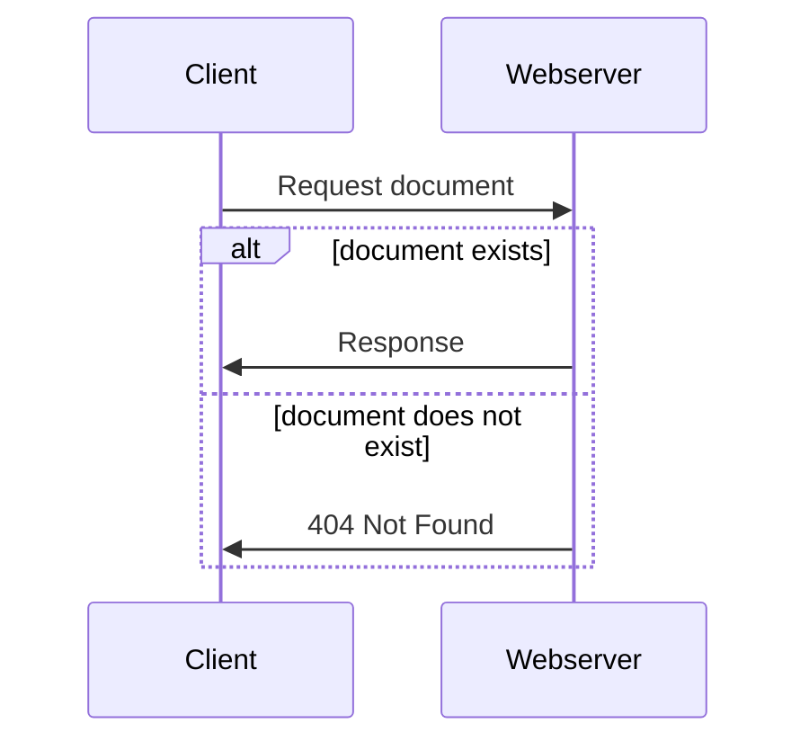

<br>
<br>

### **Optional Messages**
<br>

Basic syntax:

```
alt <Text>
    <message statements>
end
```

<br>

```
sequenceDiagram
    participant A as Stranger 1
    participant B as Stranger 2
    opt greeting
        A ->> B: Hello
    end
```

<br>

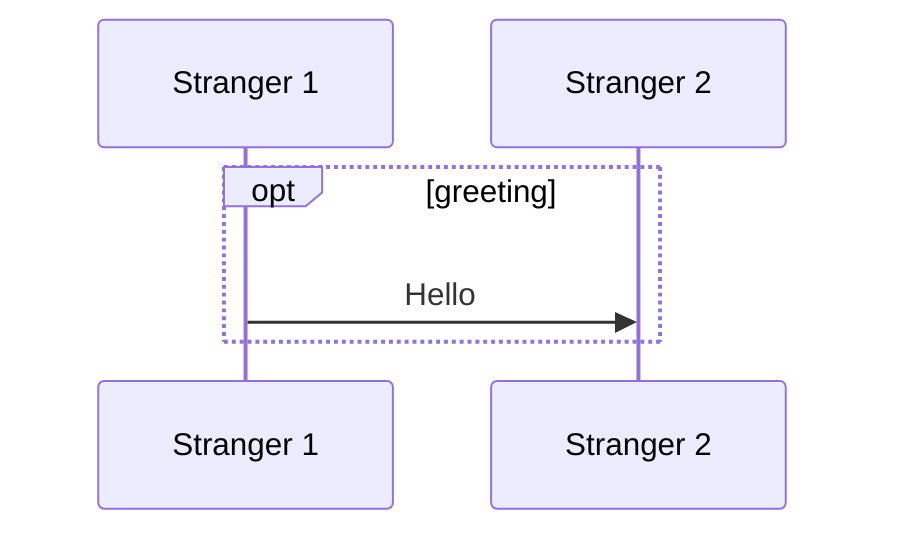

<br>
<br>

### **Parallel Messages**
<br>

Basic syntax:

```
par <Text>
    <message statements>
and <Text>
    <message statements>
and <Text>
    <message statements>
end
```

<br>

```
sequenceDiagram
    participant A as Client
    participant B as Server 1
    participant C as Server 2
    par Client to Server 1
        A ->> B: Request
    and Client to Server 2
        A ->> C: Request
    end
    B ->> A: Response
    C ->> A: Response
```

<br>

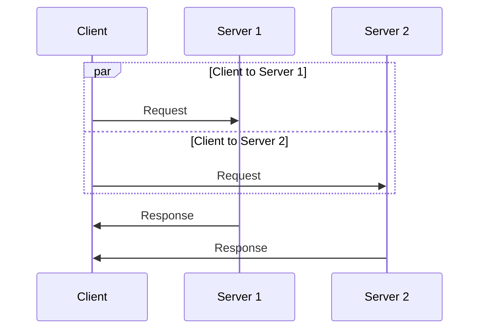

<br>
<br>

### **Critical Reqion**
<br>

Basic syntax:

```
critical <Text>
    <message statements>
end
```

<br>

```
critical <Text>
    <message statements>
    option <Text>
        <message statements>
    option <Text>
        <message statements>
end 
```

<br>
<br>

```
sequenceDiagram
    actor A as User
    participant B as Application
    critical Login
        A ->> B: Credentials
        option Credentials correct
            B ->> A: Grant Access
        option Credential incorrect
            B ->> A: Deny Access
    end
```

<br>

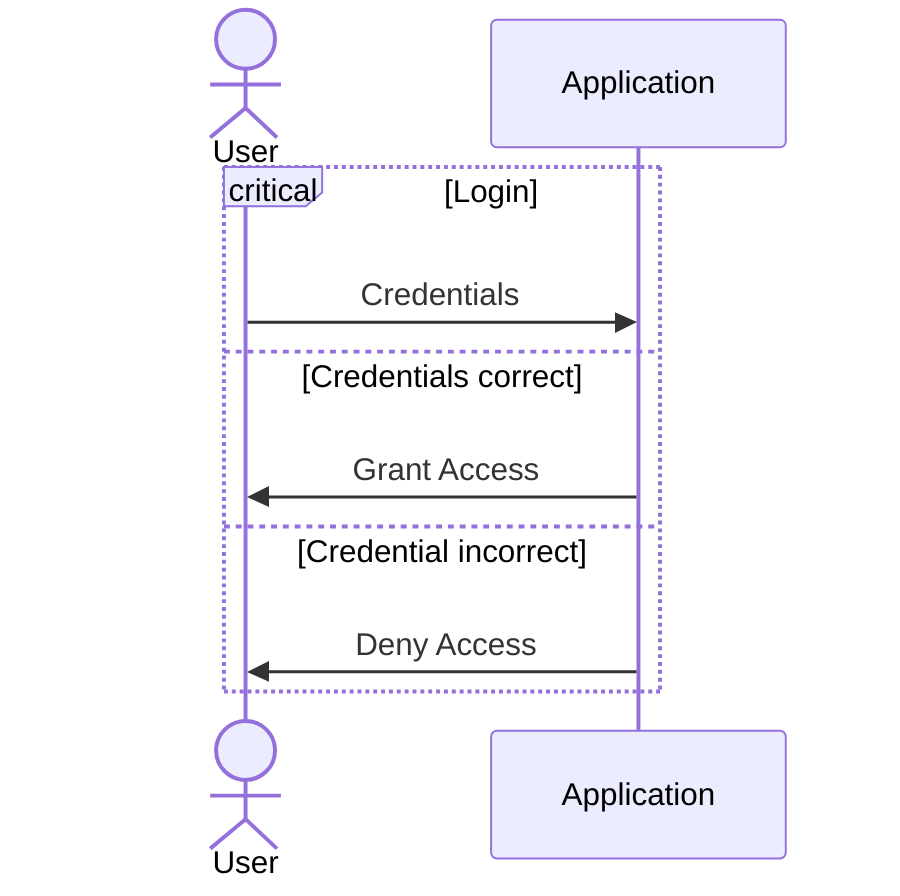

<br>
<br>

### **Break**
<br>

* indicates end of sequence (e.g. exceptions)

<br>

Basic syntax:

```
break <text>
    <message statement>
end
```

<br>

```
sequenceDiagram
    actor A as User
    participant B as Application
    A ->> B: Input
    break when input is invalid
        B ->> A: Error Message
    end
    B --> A: Response
```

<br>

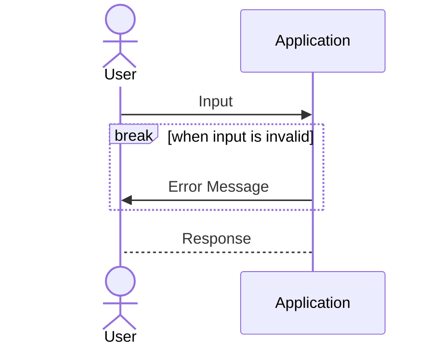

<br>
<br>

### **Activate Numbering**
<br>

Basic syntax:

```
sequenceDiagram
    autonumber
    <content>
```

<br>

```
sequenceDiagram
    autonumber
    participant A as Participant 1
    participant B as Participant 2
    A ->> B: Message
    B ->> A: Message
    A ->> A: Check
    A ->> B: Message
```

<br>

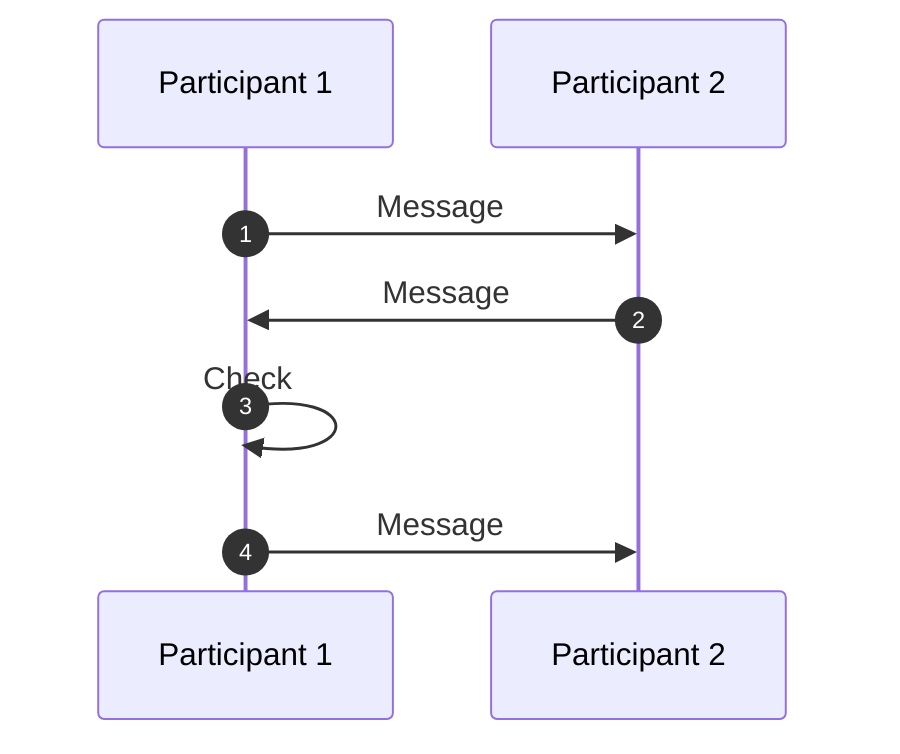

<br>
<br>
<br>

## **Hightlight Background**
<br>

Basic syntax:

```
rect rgb(61, 216, 154)
 <content>
end
```

<br>

```
sequenceDiagram
    participant A as Participant 1
    participant B as Participant 2
    rect reg(61, 216, 154)
        A ->> B: Message 1
    end
    B ->> A: Message 2
```

<br>

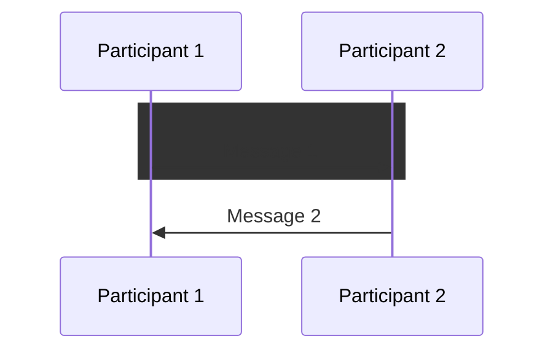

<br>
<br>
<br>

## **Style**
<br>

* Style classes for sequence diagrams are defined in file _src/themes/sequence.scss_

<br>
<br>
<br>

## **Configuration**
<br>

HTML Embedded:

```html
<script src="https://cdn.jsdelivr.net/npm/mermaid/dist/mermaid.min.js"></script>

<script>
    const sequenceConfig = {
        /* custom paramater values */
    };

    mermaid.initialize(sequenceConfig);
</script>
```

<br>
<br>

Configuration Parameters:

* copied from [mermaid documentation](https://mermaid-js.github.io/mermaid/#/sequenceDiagram)

<br>

| Parameter         | Description                                                                                                                                | Default value                  |
| ----------------- | ------------------------------------------------------------------------------------------------------------------------------------------ | ------------------------------ |
| mirrorActors      | Turns on/off the rendering of actors below the diagram as well as above it                                                                 | false                          |
| bottomMarginAdj   | Adjusts how far down the graph ended. Wide borders styles with css could generate unwanted clipping which is why this config param exists. | 1                              |
| actorFontSize     | Sets the font size for the actor's description                                                                                             | 14                             |
| actorFontFamily   | Sets the font family for the actor's description                                                                                           | "Open Sans", sans-serif        |
| actorFontWeight   | Sets the font weight for the actor's description                                                                                           | "Open Sans", sans-serif        |
| noteFontSize      | Sets the font size for actor-attached notes                                                                                                | 14                             |
| noteFontFamily    | Sets the font family for actor-attached notes                                                                                              | "trebuchet ms", verdana, arial |
| noteFontWeight    | Sets the font weight for actor-attached notes                                                                                              | "trebuchet ms", verdana, arial |
| noteAlign         | Sets the text alignment for text in actor-attached notes                                                                                   | center                         |
| messageFontSize   | Sets the font size for actor<->actor messages                                                                                              | 16                             |
| messageFontFamily | Sets the font family for actor<->actor messages                                                                                            | "trebuchet ms", verdana, arial |
| messageFontWeight | Sets the font weight for actor<->actor messages                                                                                            | "trebuchet ms", verdana, arial |