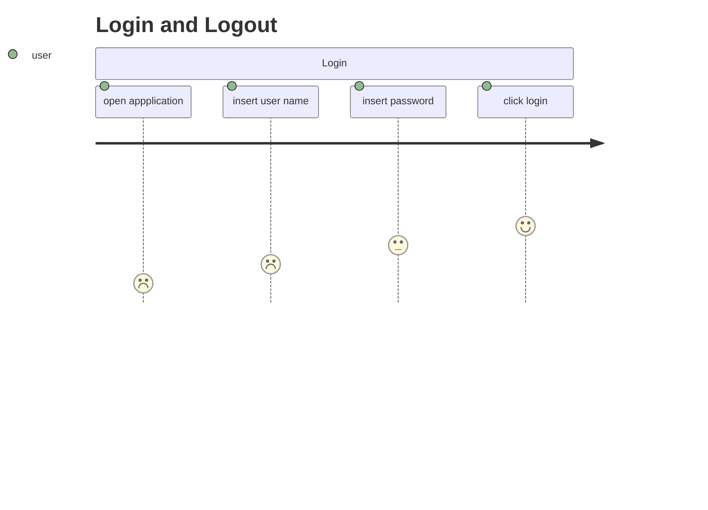
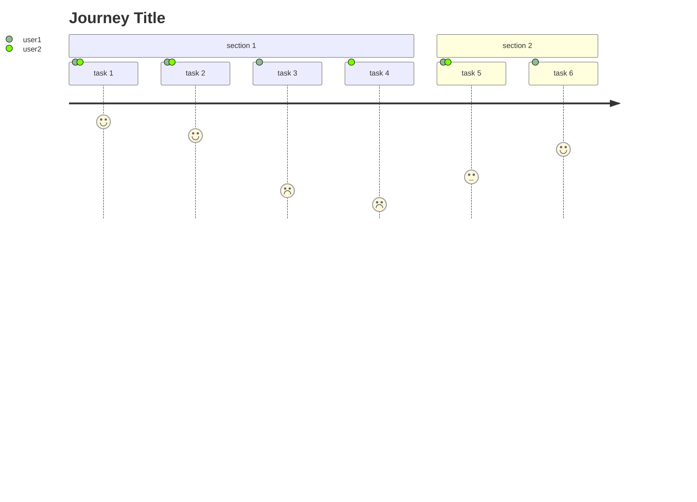

# **User Journey Diagram**
<br>

## **Table Of Contents**
<br>

- [**User Journey Diagram**](#user-journey-diagram)
  - [**Table Of Contents**](#table-of-contents)
  - [**General**](#general)
  - [**Syntax**](#syntax)

<br>
<br>
<br>

## **General**
<br>

A user journey diagram descripes and rates the steps a user takes to complete a task within an application.

<br>



<br>
<br>
<br>

## **Syntax**
<br>

Basic syntax:

```
journey
    title <title text>
    section <section name>
        <task name>: <task score>: <comma separated list of actors>
```

<br>

```
journey
    title Journey Title
    section section 1
       task 1: 7: user1, user 2
       task 2: 6: user1, user 2
       task 3: 2: user1
       task 4: 1: user 2
    section section 2
        task 5: 3: user 1, user2
        task 6: 5: user1
```

<br>

